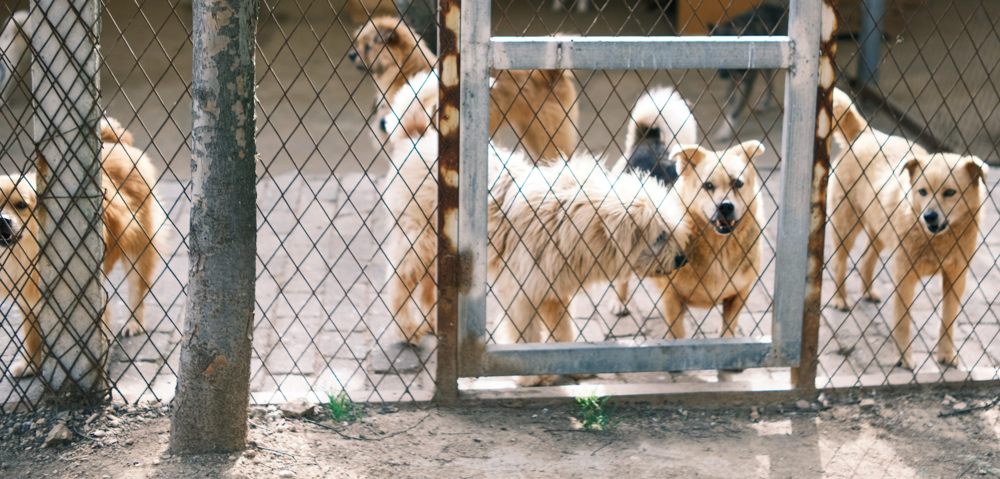

# Pet Shelter 
### (pet study project)
<h4 align="center">
  
</h4>

***Добро пожаловать!*** Это учебный проект группового этапа разработки.
Который я и мои коллеги проходим в рамках обучения.
Данный проект представляет из себя telegram бота,
который сможет отвечать на популярные вопросы людей о том,
что нужно знать и уметь, чтобы забрать животное из приюта.

Также волонтеры приюта в течение месяца просят новых хозяев присылать
ежедневный отчет о том, как животное приспосабливается к новой обстановке.

---

### Какие цели мы преследуем?

1. Отработать навыки общения в коллективе.
2. Освоить методику работы Gitflow.
3. Научиться взаимодействию в команде (Agile, Scrum, спринты, дейли, демо, ретро).
4. Освоить ведение проекта в GitHub в команде.

## Авторы

- [Роман Зражевский](https://github.com/ZRoman87)
- [Владимир Кудрявцев](https://github.com/ztmwtm)
- [Вячеслав Марчков](https://github.com/SlavaMarchkov)
- [Георгий Родионов](https://github.com/GEORGE2066)
- [Анастасия Шорикова](https://github.com/DuBlack1)

## Использование

## Зачем?

## Вики

## Лицензия

ISC
